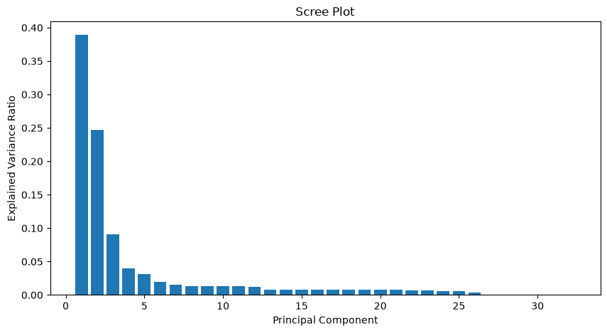
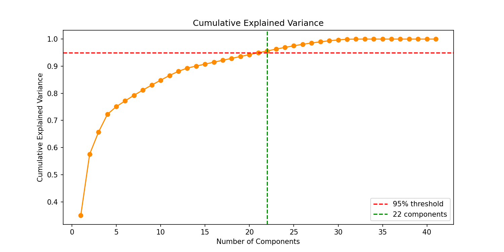
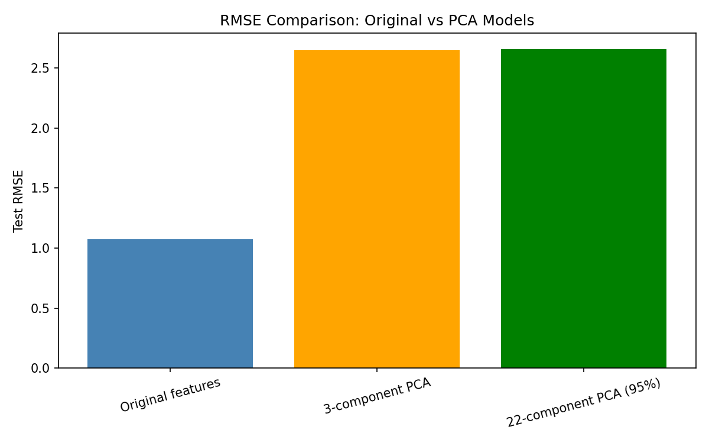
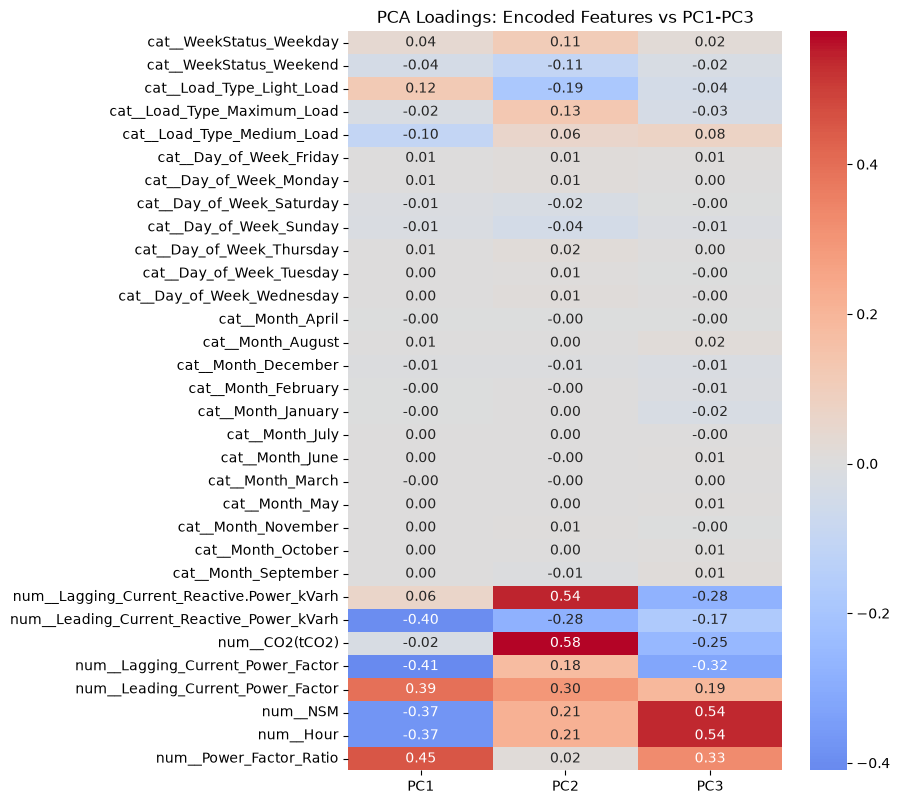
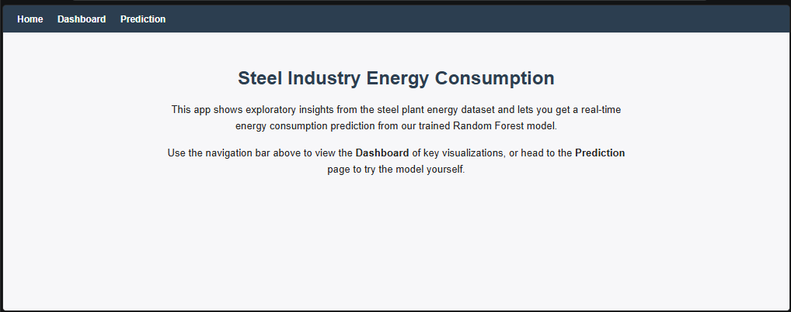
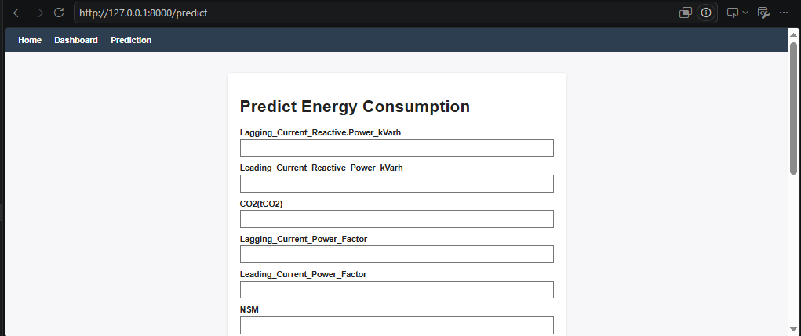

# Energy Prediction FastAPI Dashboard

Dimensionality reduction and deployment for a steel plant energy consumption model.
This project takes an engineered dataset and a trained Random Forest model, applies
Principal Component Analysis (PCA) to explore feature redundancy, and deploys the
model behind a FastAPI web dashboard for real-time predictions.

## Table of Contents

- [Overview](#overview)
- [Dataset](#dataset)
- [Project Structure](#project-structure)
- [Part 1 — PCA Analysis](#part-1--pca-analysis)
- [Part 2 — FastAPI Dashboard](#part-2--fastapi-dashboard)
- [Model File](#model-file)
- [Running the App](#running-the-app)
- [Screenshots](#screenshots)
- [Key Findings](#key-findings)

## Overview

Steel manufacturing plants draw large, variable amounts of electricity depending on
machinery load, time of day, and day of week. This project:

1. Applies PCA to a fully encoded feature set to measure how much of that
   variance can be compressed into fewer dimensions
2. Compares model accuracy across the original feature set vs. two PCA-reduced
   versions
3. Deploys the best-performing model behind a FastAPI dashboard with a home page,
   an EDA dashboard, and a live prediction form

## Dataset

**Steel Industry Energy Consumption Dataset** — real energy readings from a steel
manufacturing plant, including:

- `Usage_kWh` — energy consumption (target variable)
- Reactive/lagging/leading power and power factor readings
- `CO2(tCO2)` — carbon emissions
- `NSM` — number of seconds since midnight (time-of-day indicator)
- `Hour`, `Day_of_week`, `Month`, `WeekStatus`, `Weekend`, `Load_Type` — categorical
  and engineered time-based features
- `Power_Factor_Ratio` — engineered feature (leading power factor ÷ lagging power factor)

## Project Structure

```
.
├── main.py                      # FastAPI application
├── model.joblib                 # Trained pipeline (see Model File section — hosted as a release asset)
├── requirements.txt
|── Steel_energy_consumption_engineered.csv
│── pca.ipynb                 # PCA analysis notebook, fully run with outputs
├── templates/
│   ├── index.html
│   ├── dashboard.html
│   └── predict.html
├── static/                       # EDA charts served by the dashboard
└── images/                       # Screenshots used in this README
```

## Part 1 — PCA Analysis

The notebook (`pca.ipynb`) does the following:

1. Loads the engineered dataset and applies the same train/test split used to
   train the baseline model (80/20, `random_state=42`)
2. One-hot encodes categorical columns and standard-scales numeric columns,
   fitting only on the training set to avoid data leakage
3. Fits PCA across all encoded features and produces a **scree plot** and a
   **cumulative explained variance plot** with a 95% threshold line
4. Retrains a Random Forest model on three different feature sets:
   - the full original encoded features
   - only the first 3 principal components
   - however many components are needed to reach 95% cumulative variance
5. Compares RMSE and R² across the three versions
6. Produces a **PCA loadings heatmap** showing which original features
   contribute most to the first three components

### Scree Plot



The explained variance drops off sharply after the first two components —
together they already capture more than 55% of total variance.

### Cumulative Explained Variance



**22 out of 41** encoded features are needed to reach the 95% variance threshold —
meaning roughly half the encoded feature space is redundant.

### RMSE Comparison



| Version | Test RMSE | R² |
|---|---|---|
| Original features (41 encoded) | ~1.07 | ~0.999 |
| 3-component PCA | ~2.64 | ~0.994 |
| 22-component PCA (95% variance) | ~2.66 | ~0.994 |

### PCA Loadings Heatmap



`NSM` and `Hour` load heavily on PC3 (both capture time-of-day, as expected since
they're derived from the same information), `CO2(tCO2)` and
`Lagging_Current_Reactive.Power_kVarh` dominate PC2, and `Power_Factor_Ratio`
along with the power factor readings dominate PC1.

### Dimensionality Reduction Findings

- **Accuracy trade-off**: RMSE roughly doubles when moving from the original
  feature set to either PCA version (1.07 → ~2.65), and R² drops from 0.999 to
  0.994. That's a real cost, though 0.994 is still a strong score.
- **Redundant features**: 22 of 41 encoded features capture 95% of the variance,
  so about half the feature space (mostly from one-hot encoded categories) adds
  little unique signal.
- **Would PCA be recommended for a memory-constrained device?** Only
  conditionally — Random Forest already runs efficiently on the full feature
  set, and the accuracy drop from PCA is non-trivial for an energy-monitoring
  use case. The 3-component version captures almost all of PCA's benefit with
  the least added complexity, so if memory truly is the binding constraint,
  3 components is the more efficient choice over 22.

## Part 2 — FastAPI Dashboard

Built with **FastAPI**, **Jinja2Templates**, and **StaticFiles**, with three routes:

- **`GET /`** — home page with navigation
- **`GET /dashboard`** — displays EDA charts (energy by hour, energy by load
  type, correlation heatmap)
- **`GET /predict`** / **`POST /predict`** — a form with one input per model
  feature (dropdowns for categorical fields, text boxes for numeric fields),
  returning a live prediction on the same page

## Setup & Installation

```bash
git clone https://github.com/<your-username>/energy-prediction-fastapi-dashboard.git
cd energy-prediction-fastapi-dashboard
python -m venv venv
venv\Scripts\activate          # Windows
# source venv/bin/activate     # macOS/Linux
pip install -r requirements.txt
```

## Model File

`model.joblib` (~39MB, compressed) is **not committed directly to this repo** due
to GitHub's file size limits on regular commits. It's published as a **GitHub
Release asset** instead.

**Download it here:**
[model.joblib](https://github.com/<your-username>/energy-prediction-fastapi-dashboard/releases/download/<release-tag>/model.joblib)

After downloading, place the file in the project root — the same folder as
`main.py` — before running the app.

## Running the App

```bash
uvicorn main:app --reload
```

Then open `http://127.0.0.1:8000/` in your browser.

## Screenshots

### Home Page


### Prediction Form



The form provides dropdowns for categorical fields (`Load_Type`, `Day_of_Week`,
`Month`, `Weekend`) with valid options pulled directly from the dataset, and
plain text inputs for numeric sensor readings.

## Key Findings

- The dataset's 41 encoded features compress down to 22 components while
  retaining 95% of variance, revealing substantial redundancy — largely from
  one-hot encoded categorical columns and duplicate time-of-day signals
  (`NSM` and `Hour` capture almost the same information).
- Random Forest on the full feature set remains the most accurate option
  (R² ≈ 0.999); PCA trades some accuracy for a smaller feature space, which is
  only worth it under real memory or latency constraints.
- The deployed model uses the original, non-PCA-reduced feature set, since it
  gives the best accuracy and keeps the prediction form intuitive — users enter
  real sensor values rather than abstract PCA components.
